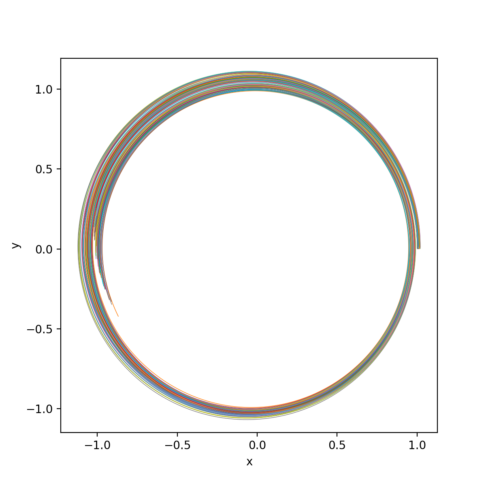

# parivp: Parallel IVP in Python using multiprocessing

This module allows for parallel integration of initial value problems (IVP) using Python's multiprocessing features. Syntax follows those of `scipy.integrate.solve_ivp()`, hence enabling parallelization with minimal changes. 

See [here](https://docs.scipy.org/doc/scipy/reference/generated/scipy.integrate.solve_ivp.html) for scipy's documentation on `solve_ivp()`.


### Dependencies

- `multiprocessing`, `numpy`, `scipy`


### Basic usage

When solving a single IVP, `solve_ivp()` takes in as basic arguments the ODE function, the time-span, the initial condition, and optionally additional arguments passed to the ODE function. 

The parallelized version of this function, `parivp.parsolve_ivp()`, takes in as arguments *lists* of these basic arguments. 


#### Example

We start by importing relevant modules (`matplotlib` is for plotting the results later), and defining the ODE; here, we are using the restricyed twobody problem: 

```python
import numpy as np
import matplotlib.pyplot as plt  # optional, for plotting results later
from parivp import parsolve_ivp

def twobody(t,state,mu):
    """Two-body equation of motion"""
    dstate = np.zeros(6,)
    dstate[0:3] = state[3:6]
    dstate[3:6] = -mu/np.linalg.norm(state[0:3])**3 * state[0:3]
    return dstate
```

We now prepare lists of the time-span, initial conditions, and additional arguments; in this case, we are only varying the initial conditition, and we keep the time-spans and arguments the same. 

```python
# number of integrations to perform
n = 50

# create list of final times
t0 = 0.0
tf = 10.0
t_spans = [(t0,tf) for el in range(n)]

# create list of initial conditions
ics = []
state0 = np.array([1.0, 0.0, 0.2, 0.0, 1.0, -0.02])
sigR, sigV = 0.02, 0.01
for idx in range(n):
    ics.append(state0 + np.concatenate((sigR*np.random.rand(3),sigV*np.random.rand(3))))

# create list of argument to EOM
ps = [(1.0,) for el in range(n)]
```

We can now call the parallel integrator function

```python
# integrate in parallel
n_cpu = 4
t_eval = np.linspace(t0,tf,1000)
respar = parsolve_ivp(fun=twobody, t_spans=t_spans, ics=ics, ps=ps, n_cpu=n_cpu, t_eval=t_eval)
```

We can visualize the results 

```python
# plot result
fig = plt.figure(figsize=(6,6))
ax = fig.add_subplot()
for sol in respar:
    ax.plot(sol.y[0,:], sol.y[1,:], linewidth=0.5)
ax.axis('equal')
ax.set(xlabel="x", ylabel="y")
plt.show()

```

<p align="center">
  
</p>


### More Examples

For examples, see scripts in `./tests`. 


